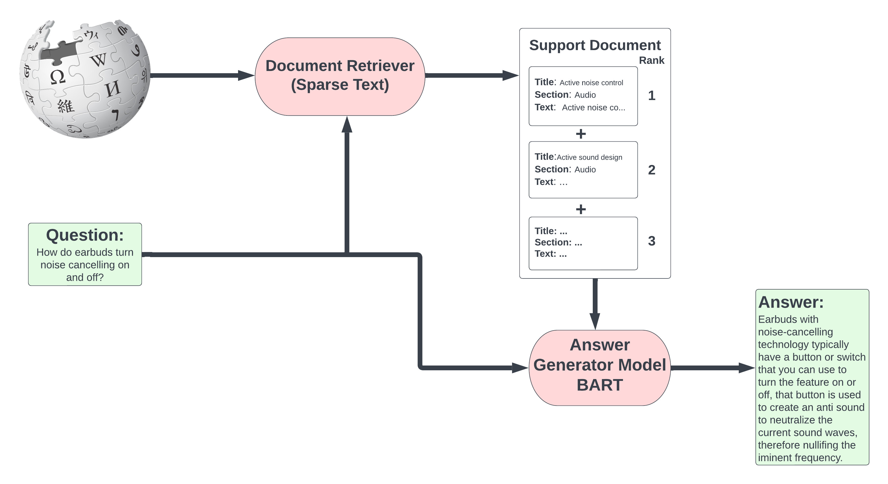
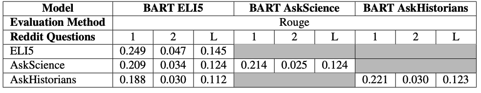

# **Recommender-System-IMDB**
This repository explains in detail the process of creating a Large Language Model (LLM) and how to perform its validation using state of the art processes. The model was trained using High-performance computing from the technical university of denmark due to the amount of parameters involved. 

# Use Case

- **Use Case Summary:**
  - The goal of this project is to generate long-form answers to complex questions using a retriever-generator pipeline. The retriever is based on BM25 and the generator is a Bidirectional AutoRegressive Transformer (BART). The models are fine-tuned on subreddits AskScience, AskHistorians and Eli5. BART-eli5 performs best on the Eli5 subreddit and also provides relevant answers to the specialized subreddits. The potential of deep learning for long-form question answering is highlighted. The code used during the project is available on Github.

- **Objective Statement:**
  - Gain knowledge on how to refine a model already in training (BART).
  - Evaluate the quality of the answers provided.
  - Understand the architecture involved in processing response requests.

  
 - **Challenges:**
   - Massive database (more than 500,000 questions from three different databases plus the entire contents of Wikipedia).
   - Lack of standardization between questions and answers among the three SubReddits, making it difficult to standardize processing.
   - Possibility of having biased answers and questions, leading to non-positive results for the end user.

  
- **Methodology / Analytic Technique:**

  - ROUGE Metrics (1, 2 and L)
  - TF-IDF
  - [Dense Passage Retrieval for Open-Domain Question Answering](https://arxiv.org/abs/2004.04906)
  - F1 Score
  - Ensemble
  - Text Masking

  
 - **Expected Outcome:**
 - A tuned model that generates answers from questions involving general knowledge, science, or history.

  
# Model Architecture

By using the Bidirectional AutoRegressive Transformer (BART) model, training using 3 different datasets (Reddit ELI5, Reddit AskHistorians and Reddit AskHistorians) and wikipedia content for generating responses this is the architecture behind how it works. A user asks a question, the text is used as inputs to the retriever along with Wikipedia content, then there is a ranking of the most similar documents using TF-IDF. Then the question text along with the pretreated model is triggered to generate a concise answer as shown in the above image.

# Data Validation
After the model has been trained, we want to look at its performance. We do this be comparing the model output to a golden
answer. The golden answer is given in the dataset as the highest rated answer for the question. As such we need a way of
comparing two strings. For this we employ Recall-Oriented
Understudy for Gisting Evaluation (ROUGE), which is a set
of different metrics. In general, each ROUGE metric uses
something called an F1-score. The F1-score is calculated
from the performance metrics Precision and Recall using the
following formula:

$$F1 = 2 \times {\text{precision x recall} \over \text{precision + recall}} $$

Recall and Precision measure the relative percentage of false
negatives and positives, respectively. These are dependant on
the ROUGE metric of interest. For ROUGE-N (n-grams), the
precision would be given by

$$ROUGE_nP = {\text{number of n-grams found in model and reference} \over \text{number of n-grams in model}} $$

,while the recall would be given by

$$ROUGE_nR = {\text{number of n-grams found in model and reference} \over \text{number of n-grams in reference}} $$

The specific ROUGE metrics we are using are ROUGE-1,
ROUGE-2 and ROUGE-L (longest common substring)

# Model Results

With the models fine tuned in their respective domains, it can be seen that the performance is on average higher compared to BART Eli5 performance on these domains. Furthermore, BART AskHistorians yields higher results in all ROUGE metrics, when compared to the answers generated by the BART Eli5 model. yielding higher results in all ROUGE metrics, when compared to the answers generated by the BART Eli5 model. As for the AskScience subreddit, the fine-tuned model showed better performance on the ROUGE-1 metric, but worse performance than the Eli5 model on ROUGE-2. The small improvement in rouge score of the model fine tuned on AskScience question compared to the ELI5 model, can be explained by the very similar questions asked in the two subreddits. Questions asked in AskHistorians are more domain specific and explains the larger improvement over the ELI5 model. One of our main assumptions for this reason is, the questions and answer format from AskHistorians have a different set of rules for users and therefore the style of writing it is different. Due to this investigative exercise, it became clearer how a second round of improvements should be conducted, especially in the processing of the information for training the model, with the hope of improving the results

# Answer Examples 

| Question from ASKH: Could you explain the ”Phantom time hypothesis”? Could this possibly be true or is there a flaw in this theory?                                                                                                                                                                                                                                                                                                                                                                                                                                                                                                                                                   |
|---------------------------------------------------------------------------------------------------------------------------------------------------------------------------------------------------------------------------------------------------------------------------------------------------------------------------------------------------------------------------------------------------------------------------------------------------------------------------------------------------------------------------------------------------------------------------------------------------------------------------------------------------------------------------------------|
| Golden Standard Answer: There’s always room for discussion, but perhaps these previous topics found through the search function will answer your inquiry. In 1991, German Publicist Heribert Illig proposed the ”Phantom Time Hypothesis”, claiming that the years between 614 to 911 never happened, but were invented later. He supported this with the apparent lack of archaeological remains from the period and some dating discrepancies.                                                                                                                                                                                                                                      |
| BART-ELI5 : The ”Phantom Time Hypothesis” is a conspiracy theory based on the idea that the Roman Empire, Pope, and possibly the Catholic Church were all involved in the creation of the modern world. The idea is that these people were able to manipulate the laws of physics in a way that allowed them to control the passage of time. The flaw in this theory is that there is no such thing as a flaw in physics.                                                                                                                                                                                                                                                             |
| BART-ASKH: I’m not a historian, but I can answer this question for you. The Phantom Time Hypothesis is not a conspiracy theory, it is a theory. It is based on the idea that there was a conspiracy by the Holy Roman Emperor Otto III, Pope Sylvester II, and possibly the Byzantine Emperor Constantine VII, to fabricate the Anno Domini dating system retrospectively, in order to place them at the special year of AD 1000, and to rewrite history to legitimize Otto’s claim to the Habsburg Empire. There is no evidence to support this theory. There is no proof to support such a conspiracy, and there is no reason to believe that it would have been possible to do so. |

# Conclusion
Cool, right? We were able to create a whole model to answer questions for me regarding specific subjects.